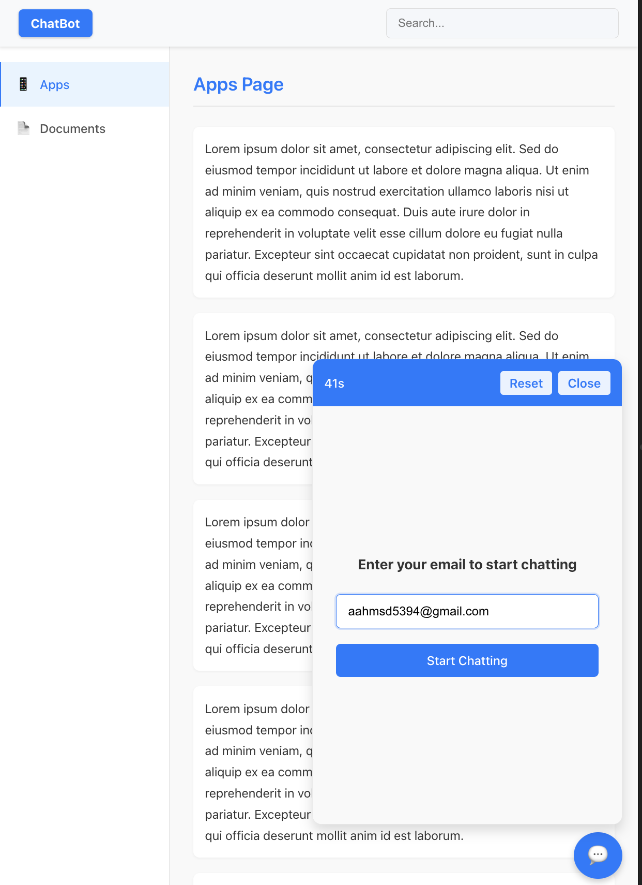

# Frontend Development Challenge: Chatbot Website



**Objective:**  
Create a responsive website using **React JS** with a chatbot interface, navigation elements, and dynamic content handling.

## Requirements:

### Layout:
- **Navbar:** 
  - Positioned at the top of the screen.
  - On the left side, include a "Logo".
  - On the right side, include a search bar input.

- **Side Menu:** 
  - Positioned on the left side of the screen.
  - Contains menu items: "Apps", "Documents".
  - When an item is selected, content corresponding to "Apps Page" or "Documents Page" should be displayed on the right side of the screen.

- **Content Area:**
  - Each page ("Apps", "Documents") should contain multiple paragraphs of text (using Lorem Ipsum) to ensure the page is scrollable for testing purposes.

### Chatbot:
- **Icon Button:** 
  - Positioned at the bottom right of the screen, visible on all pages.
  - Clicking this button opens the chatbot.

- **Chatbot Window:**
  - **Dimensions:** Width 400px, Height 600px on desktop views.
  - **Mobile View:** Full screen when opened on mobile devices.
  
  - **Components:**
    - **Header:** 
      - Contains two buttons:
        - **Reset:** Clears all conversation history.
        - **Close:** Closes the chatbot window.
      - Displays elapsed time in seconds since opening, updating every second. Reset the timer when the 'Reset' or 'Close' button is clicked.
    
    - **Message View:** 
      - Displays messages in a chat format:
        - User messages on the right side.
        - Bot responses on the left side. 
      - For bot responses, you can use placeholder text or random responses.

    - **Input View:** 
      - Allows users to type messages.
      - Messages should be displayed in the message view when the user presses the "Enter" key or clicks the send button.

## Functionality:
- **Interactivity:** 
  - Menu selection should update the content area.
  - Chatbot should handle sending messages and responding with mock data or placeholders.
  - **Search Bar:** 
    - As the user types text into the search bar, only paragraphs containing the typed text should be shown in the content area.
    - Highlight the matching text within the paragraphs in the view.

## Technical Specifications:
- **Frameworks/Libraries:** Use **React JS**.
- **Version Control:** Create a public repository on GitHub for this project. Include a README with setup instructions, how to run the project, and any decisions you made during development.

# Chatbot Application

A full-stack chatbot application with React frontend and FastAPI backend, integrating OpenAI function calling and Cal.com API.

## Quick Start Guide

### Running the Application

#### Backend Setup

1. Navigate to the backend directory:
```bash
cd chatbot-app/backend
```

2. Create and activate a virtual environment:
```bash
python3 -m venv venv
source venv/bin/activate  # On Windows: venv\Scripts\activate
```

3. Install the required dependencies:
```bash
pip install -r requirements.txt
```

4. Set up environment variables:
   - Create or modify the `.env` file in the backend directory with the following content:
   ```
   OPENAI_API_KEY=your_openai_api_key
   CALCOM_API_KEY=your_calcom_api_key
   ```
   - Replace `your_openai_api_key` with your OpenAI API key
   - Replace `your_calcom_api_key` with your Cal.com API key
   - Note: If you don't have a Cal.com API key, the application will use a mock implementation for Cal.com API calls

5. Run the backend server:
```bash
python -m uvicorn main:app --reload --port 8000
```
   - The backend server will be available at http://localhost:8000

#### Frontend Setup

1. Open a new terminal window and navigate to the frontend directory:
```bash
cd chatbot-app/frontend
```

2. Install the required dependencies:
```bash
npm install
```

3. Run the frontend development server:
```bash
npm run dev
```
   - The frontend application will be available at http://localhost:5173 (or another port if 5173 is in use)

### Using the Application

1. Open your browser and navigate to http://localhost:5173
2. Use the side menu to navigate between "Apps" and "Documents" pages
3. Use the search bar to filter content
4. Click the chat icon in the bottom right corner to open the chatbot
5. Enter your email to start chatting with the AI assistant
6. The chatbot can help you with:
   - Checking available time slots
   - Booking new events
   - Listing your scheduled events
   - Canceling or rescheduling events

## Testing the Cal.com API Functions

The application uses a mock implementation for Cal.com API functions. You can test these functions by asking the chatbot:

### 1. Check Available Time Slots
Try asking:
- "What time slots are available tomorrow?"
- "Show me available slots for next Monday"
- "I need to see available times for July 15th"

### 2. Book an Event
Try asking:
- "Book a meeting for tomorrow at 10:00 AM"
- "Schedule a call on Friday at 2:30 PM for project discussion"
- "I want to book a meeting on 2023-12-15 at 11:00 AM for team review"

### 3. List Events
Try asking:
- "Show me my scheduled meetings"
- "What events do I have coming up?"
- "List all my appointments"

### 4. Cancel an Event
First book an event, then try asking:
- "Cancel my meeting at 10:00 AM tomorrow"
- "I need to cancel my event with ID mock_event_1"
- "Delete my appointment on Friday"

### 5. Reschedule an Event
First book an event, then try asking:
- "Reschedule my 10:00 AM meeting to 2:00 PM"
- "Move my appointment on Friday to Monday at 11:30 AM"
- "Change my event with ID mock_event_1 to next Tuesday at 3:00 PM"

### Debugging Tips

If you encounter issues:

1. Check the backend console for error messages
2. Verify both frontend and backend are running
3. Ensure your OpenAI API key is valid
4. Remember that the Cal.com API is mocked, so no real Cal.com account is needed
5. The mock data is stored in memory, so it will be reset if you restart the backend server

## Prerequisites

- Node.js (v16 or higher)
- Python 3.8 or higher
- npm or yarn
- Git

## Project Structure

- `chatbot-app/frontend/`: React frontend application
- `chatbot-app/backend/`: FastAPI backend application
  - `main.py`: Main application file with API endpoints and OpenAI function calling
  - `requirements.txt`: Python dependencies

## Cal.com API Integration

The application integrates with the Cal.com API to manage calendar events. If you don't have a Cal.com API key, the application will use a mock implementation that simulates the Cal.com API behavior. This allows you to test the application without a real Cal.com account.

To get a real Cal.com API key:
1. Sign up for a Cal.com account at https://cal.com
2. Go to Settings > Developer > API Keys
3. Create a new API key and add it to your `.env` file

## Original Challenge Requirements

**Objective:**  
Create a responsive website using **React JS** with a chatbot interface, navigation elements, and dynamic content handling.

### Layout:
- **Navbar:** 
  - Positioned at the top of the screen.
  - On the left side, include a "Logo".
  - On the right side, include a search bar input.

- **Side Menu:** 
  - Positioned on the left side of the screen.
  - Contains menu items: "Apps", "Documents".
  - When an item is selected, content corresponding to "Apps Page" or "Documents Page" should be displayed on the right side of the screen.

- **Content Area:**
  - Each page ("Apps", "Documents") should contain multiple paragraphs of text (using Lorem Ipsum) to ensure the page is scrollable for testing purposes.

### Chatbot:
- **Icon Button:** 
  - Positioned at the bottom right of the screen, visible on all pages.
  - Clicking this button opens the chatbot.

- **Chatbot Window:**
  - **Dimensions:** Width 400px, Height 600px on desktop views.
  - **Mobile View:** Full screen when opened on mobile devices.
  
  - **Components:**
    - **Header:** 
      - Contains two buttons:
        - **Reset:** Clears all conversation history.
        - **Close:** Closes the chatbot window.
      - Displays elapsed time in seconds since opening, updating every second. Reset the timer when the 'Reset' or 'Close' button is clicked.
    
    - **Message View:** 
      - Displays messages in a chat format:
        - User messages on the right side.
        - Bot responses on the left side. 
      - For bot responses, you can use placeholder text or random responses.

    - **Input View:** 
      - Allows users to type messages.
      - Messages should be displayed in the message view when the user presses the "Enter" key or clicks the send button.

### Functionality:
- **Interactivity:** 
  - Menu selection should update the content area.
  - Chatbot should handle sending messages and responding with mock data or placeholders.
  - **Search Bar:** 
    - As the user types text into the search bar, only paragraphs containing the typed text should be shown in the content area.
    - Highlight the matching text within the paragraphs in the view.

### Technical Specifications:
- **Frameworks/Libraries:** Use **React JS**.
- **Version Control:** Create a public repository on GitHub for this project. Include a README with setup instructions, how to run the project, and any decisions you made during development.